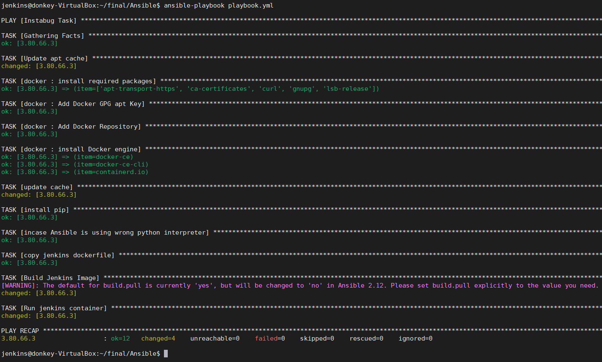

Using Jenkins
Build a pipeline job with Docker to build this repo https://github.com/Rosalita/GoViolin
The pipeline should be able to build the code using docker and reports if any errors happened in the build.The output of the build step should be a docker image pushed to dockerhub or any docker repo you want.
Also as a plus create kubernetes manifests to deploy the app using them on kubernetes (you can use minikube to test)

*Provision AWS EC2 and output ansible inventory template in Ansible directory using terraform*

*Install Docker and Run jenkins Container on port 8080*

*Container Started and jenkins is ready*

*Configure Jenkins pipleline*

*Pipeline Finished Successfully*

*Message sent to Slack of Successful build [Second fail message was for testing]*

*Image pushed Successfully to dockerhub*

*-------------------------------------------------------------------------------------------------------------------*
*-------------------------------------------------------------------------------------------------------------------*

*Kubernates deployment and service manifist running Successfully*

*Kube deployment can be accessed online*

